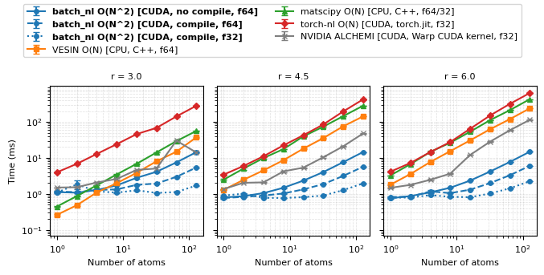

# batch_nl — Batched neighbour-list builder in PyTorch

`batch_nl` provides fully vectorised, GPU-accelerated batched neighbour-list construction for periodic atomistic systems using PyTorch. All configurations are processed together in a single tensor batch, to enable fast neighbour search and seamless integration with MLIPs and other batched workflows. 

The package is in an early stage, so contributions and suggestions for improving API coverage are very welcome.

# Performance benchmarks on RTX 6000

A test for batches of structures containing 128 atoms.


For the full benchmark against currently available neighbour lists, see

[examples/benchmark_multiple_structure.ipynb](examples/benchmark_multiple_structure.ipynb).

---

## Installation

### One-line install (from GitHub)

```bash
pip install git+https://github.com/venkatkapil24/batch_nl.git
```

### Install from source (recommended for development)

```bash
git clone https://github.com/venkatkapil24/batch_nl.git
cd batch_nl
pip install -e .
```

---

## Quick start (batched usage)

```python
from ase.build import bulk
from batch_nl import NeighbourList

cutoff = 3.0
device = "cuda:0"

base = bulk("C", "diamond", a=3.57)

configs = [
    base * (2, 2, 2),   # config 0
    base * (3, 3, 3),   # config 1
    base * (4, 4, 4),   # config 2
]

list_of_positions = [
    atoms.positions for atoms in configs
        ]

list_of_cells     = [
    atoms.cell.array for atoms in configs
    ]

nl = NeighbourList(
    list_of_positions=list_of_positions,
    list_of_cells=list_of_cells,
    cutoff=cutoff,
    device=device,
)

nl.load_data()

# Output with global batch indices
output = nl.calculate_neighbourlist(
    use_torch_compile=True
)

r_edges, r_S_int, r_S_cart, r_d = output 

# Or the familiar matscipy-style output
(
    atom_index_list,
    neighbor_index_list,
    int_shift_list,
    cart_shift_list,
    distance_list,
) = nl.get_matscipy_output_from_batch_output(*output)

for cfg in range(len(configs)):
    print(f"Configuration {cfg}: {len(atom_index_list[cfg])} neighbour pairs")
```

---

## Understanding the output

### 1. Global batched output (`calculate_neighbourlist`)

```
r_edges                 (2, n_edges)
r_S_int                 (n_edges, 3)
r_S_cart                (n_edges, 3)
r_distances             (n_edges,)
```

Atoms from different configurations are concatenated into a **global index**:

- Config 0: atoms `[0 … N0−1]`
- Config 1: atoms `[N0 … N0+N1−1]`
- Config 2: atoms `[N0+N1 … N0+N1+N2−1]`

Thus a pair like:

```
r_edges[:, k] = [42, 99]
```

means that *global* atom 42 has global atom 99 as a neighbour under the lattice shift
r_S_int[k] (an integer triplet indicating the periodic image), or equivalently
r_S_cart[k] (the same shift represented as a Cartesian displacement). This output representation is ideal for constructing graphs or atomic features over a batch of configurations.

---

### 2. Per‑configuration (matscipy-style) output

`get_matscipy_output_from_batch_output(...)` produces lists of length `n_configs`:

- `atom_index_list[cfg]`      → `(n_edges_cfg,)` local source indices  
- `neighbor_index_list[cfg]`  → `(n_edges_cfg,)` local neighbour indices  
- `int_shift_list[cfg]`       → `(n_edges_cfg, 3)` integer shifts  
- `cart_shift_list[cfg]`      → `(n_edges_cfg, 3)` Cartesian shifts  
- `distance_list[cfg]`        → `(n_edges_cfg,)` distances  

Local indices always run from `0 … n_atoms_in_cfg−1`.  
This matches the standard matscipy interface.

---

## batch_nl API Overview

### `NeighbourList`

```python
nl = NeighbourList(
    list_of_positions=list_of_positions,
    list_of_cells=list_of_cells,
    cutoff=cutoff,
    float_dtype=torch.float32,
    device=device,
)
```

#### Parameters
```
list_of_positions      (list[(n_i, 3)])       Cartesian coordinates per configuration
list_of_cells          (list[(3, 3)])         Cell matrices per configuration
cutoff                 (scalar)               Cutoff radius (float, int, or tensor)
float_dtype            (torch.dtype)          One of {float16, float32, float64, bfloat16}
device                 (str | torch.device)   "cpu", "cuda", or explicit device
```

---

### `load_data()`

#### Produces (internal tensors)
```
batch_positions_tensor   (n_configs, n_max, 3)
batch_mask_tensor        (n_configs, n_max)
batch_cell_tensor        (n_configs, 3, 3)
```

---

### `calculate_neighbourlist(use_torch_compile=True)`

#### Parameters
```
use_torch_compile        (bool)    Enable torch.compile acceleration
```

#### Returns
```
r_edges                  (2, n_edges)        Global source/target atom indices
r_S_int                  (n_edges, 3)        Integer lattice shifts
r_S_cart                 (n_edges, 3)        Cartesian lattice shifts
r_distances              (n_edges,)          Pair distances
```

---

### `get_matscipy_output_from_batch_output(...)`

#### Converts global indexing → local indexing

#### Parameters
```
r_edges                  (2, n_edges)
r_integer_lattice_shifts (n_edges, 3)
r_cartesian_lattice_shifts (n_edges, 3)
r_distances              (n_edges,)
device                   ("cpu" | "cuda" | None)
```

#### Returns (lists, length = n_configs)
```
atom_index_list[c]        (n_edges_c,)       Local source atom indices
neighbor_index_list[c]    (n_edges_c,)       Local neighbour atom indices
int_shift_list[c]         (n_edges_c, 3)     Integer shifts per pair
cart_shift_list[c]        (n_edges_c, 3)     Cartesian shifts per pair
distance_list[c]          (n_edges_c,)       Distances per pair
```

---

## Testing

Tests include unit cells with varying skews taken from torch-sim with matscipy as the ground truth.


```bash
pytest
```

---

## License

`batch_nl` is distributed under the **Apache License 2.0**.  
Users are free to use, modify, and redistribute the software, provided attribution
and license terms are preserved.
